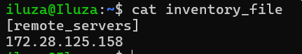
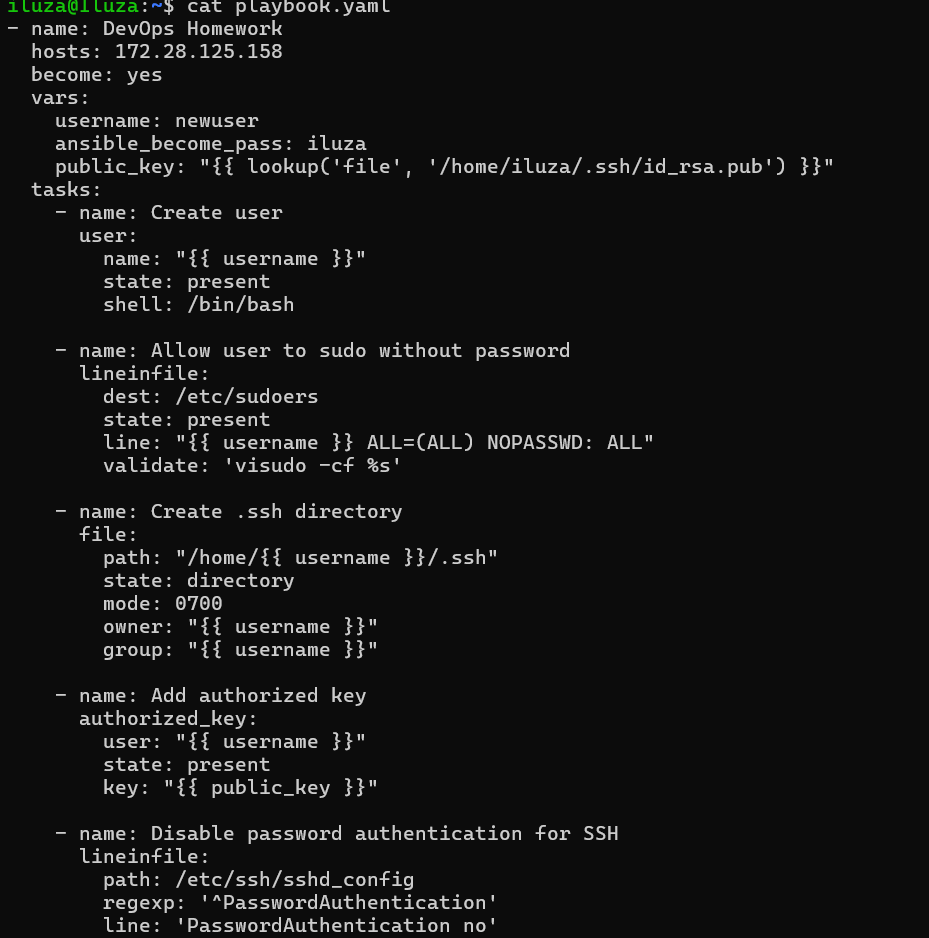
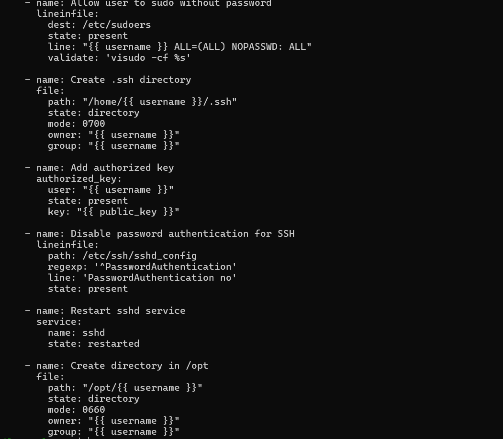
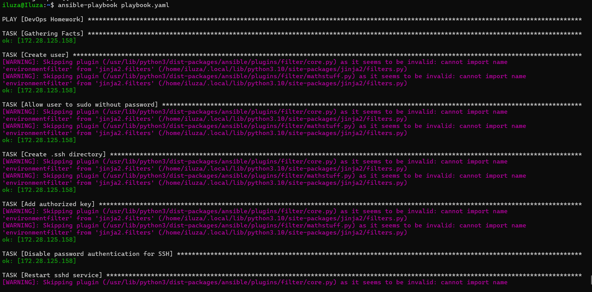
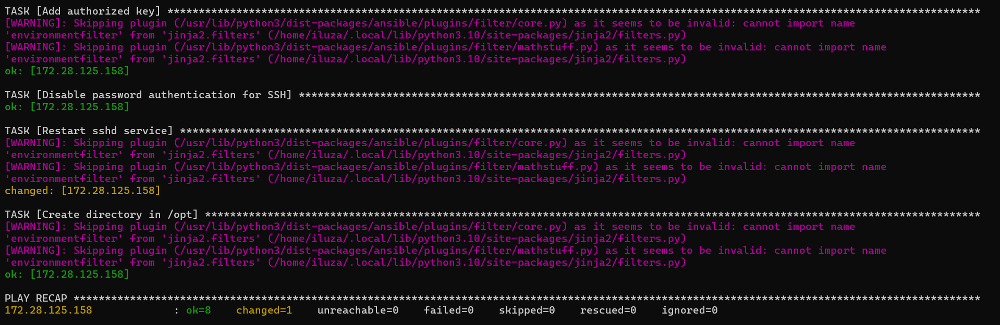
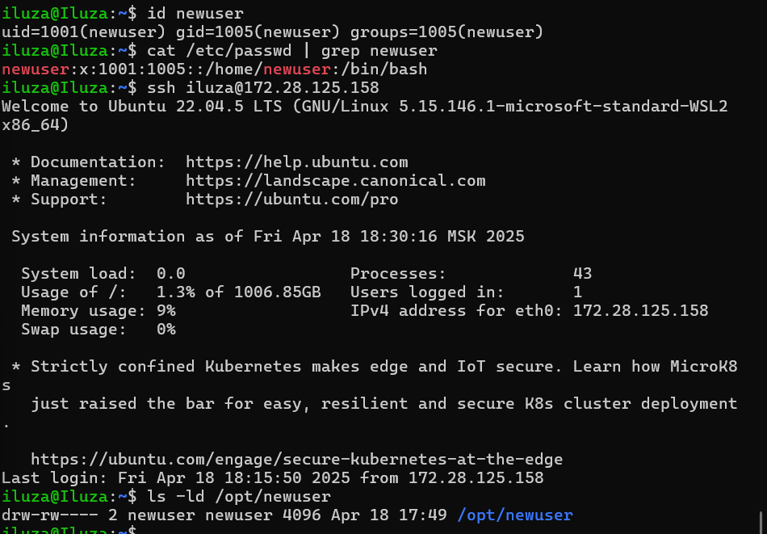

Выполняла на Ubuntu

Установила Ansible c помощью команды sudo apt install ansible

Прописала в файле 'inventory_file'

Создала файл с расширением 'playbook.yml', написала туда следующий playbook

С помощью команды ansible-playbook playbook.yml

И теперь можно проверить

