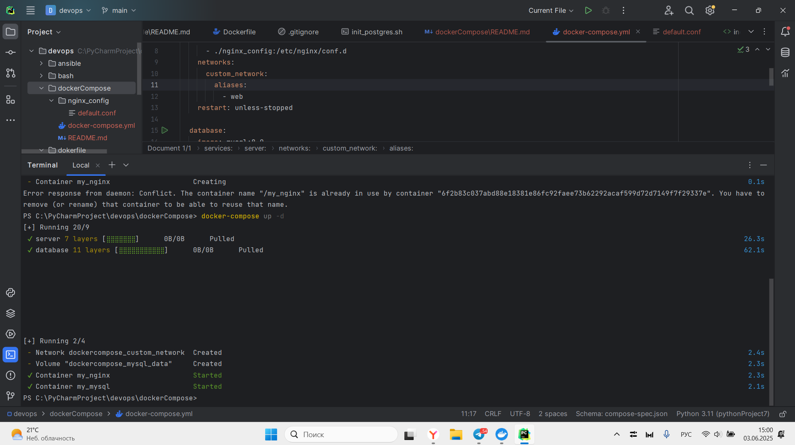
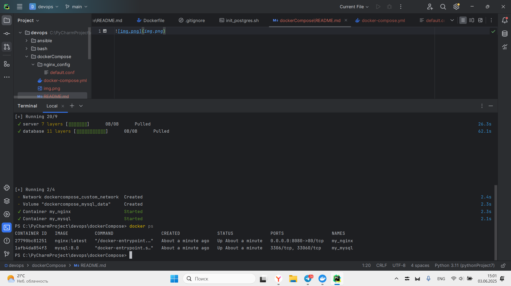
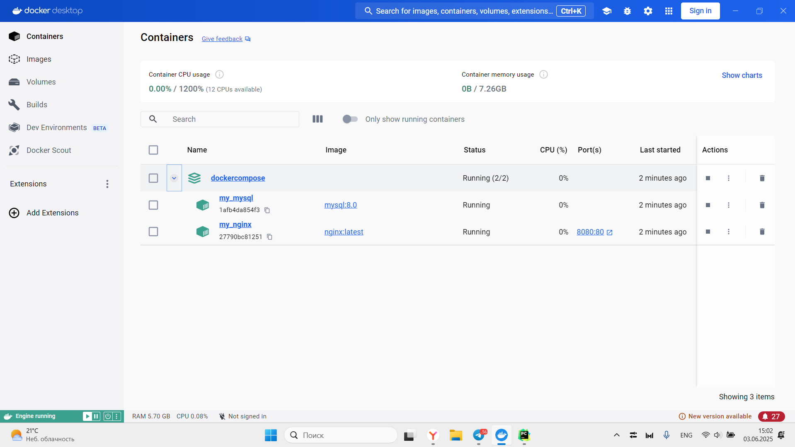

1. Создадим файлы с именем docker-compose.yml и nginx_config/default.conf(определяет, как ваш веб-сервер будет обрабатывать запросы)
2. Запускаем контейнеры с помощью команды: docker-compose up -d 
3. Смотрим, что контейнеры запущены с помощью команды: docker ps

Результат:

