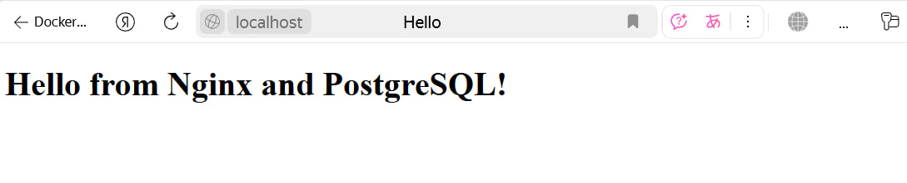

1. Прописываем Dockerfile

2. Создаем необходимые файлы:

- init_postgres.sh(Это скрипт инициализации базы данных PostgreSQL , который запускается при старте контейнера)
- index.html(Этот файл представляет собой тестовую HTML-страницу, которая будет отображаться при доступе к веб-серверу Nginx)

3. Потом собираем образ командой: docker build -t galieva_ii_image_2025-06-03 .

4. Вывод слоев образа командой: docker history galieva_ii_image_2025-06-03

Образ создался

Открывает html 

